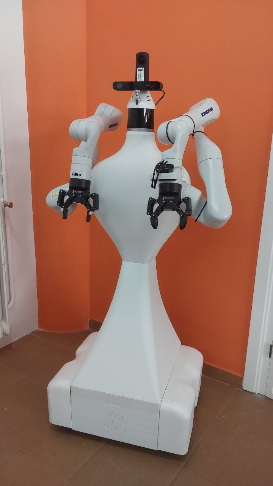

# P3Bot

P3Bot is a mobile manipulation robot featuring an omnidirectional drive base with four Mecanum wheels and dual Kinova Gen3 7-DOF robotic arms, each equipped with a 85mm parallel gripper. Designed for research, automation, and flexible deployment in structured environments.

<strong>Table of Contents</strong>

- [Overview](#p3bot)
- [3D Printing Files](#3d-printing-files)
- [Simulation Environment](#simulation-environment)
- [Hardware Components](#hardware-components)
  - [Drive Base & Motors](#drive-base--motors)
  - [Robotic Arms](#robotic-arms)
  - [Sensors](#sensors)
  - [Control Systems](#control-systems)
- [Quick Links](#quick-links)

---

## 3D Printing Files

P3Bot was printed on a **Creality CR-5060 PRO** using **Recycled PLA** from [SmartMaterials3D](https://www.smartmaterials3d.com/pla-recycled).  
The complete `.3mf` project file is available here: [P3bot.3mf](print/P3bot.3mf)

---

## Simulation Environment

For virtual testing and development, use the official **[webots-p3bot bridge](https://github.com/robocomp/webots-p3bot)**, which provides seamless Webots integration for simulation, perception, and control pipelines.

## Robot Description

The kinematic and visual model of P3Bot is available in two standard formats for simulation and integration:

| Format | File Path | Purpose |
|--------|-----------|---------|
| URDF | [urdf/P3Bot.urdf](urdf/P3Bot.urdf) | Standard robot description format for ROS, Gazebo, and MoveIt integration |
| Proto | [proto/P3Bot.proto](proto/P3Bot.proto) | Simulation-ready model definition optimized for Webots and custom physics engines |

These files define the robot's link hierarchy, joint configurations, collision meshes, and visual representations. Verify that they match your physical build before deployment.

---

## CORTEX Configuration

The runtime configuration for P3Bot is managed through the CORTEX framework. All component parameters and network bindings are available in:
[cortex/P3bot.json](cortex/P3bot.json)

---
## Hardware Components

### Drive Base & Motors
- **4× Omnidirectional Wheels** (Mecanum configuration)
- Controlled via the **[SVD48V Motor Controller](https://github.com/robocomp/robocomp-shadow/tree/main/components/SVD48VBase)**

### Robotic Arms
- **Dual Kinova Gen3 7-DOF arms** with 85mm parallel grippers
- Driver: [kinova_controller_cpp](https://github.com/robocomp/manipulation_kinova_gen3/tree/P3Bot/agents/kinova_controller_cpp)

### Sensors

| Sensor Type | Model | RoboComp Component |
|-------------|-------|-------------------|
| 360° Camera | Ricoh Theta Z1 | [ricoh_omni](https://github.com/robocomp/robocomp-robolab/tree/master/components/hardware/camera/ricoh_omni) |
| Stereo Depth Camera | ZED 2i | [zed_component](https://github.com/robocomp/robocomp-shadow/tree/main/insect/zed_component) |
| 3D LiDAR | RoboSense Helios | [lidar3D](https://github.com/robocomp/robocomp-robolab/tree/master/components/hardware/laser/lidar3D) |
| IMU | Phidgets M0T0110_0 |  |
| Power sensor | INA226 | [INA226](https://github.com/alfiTH/EBO_V2/tree/main/components/INA226) |

#### Point Cloud Processing
Raw LiDAR data can be filtered, downsampled, and preprocessed using the **[lidar3DFilter](https://github.com/robocomp/robocomp-robolab/tree/master/components/hardware/laser/lidar3DFilter)** component.

### Control Systems

Two primary control modes are available:

1. **Full Body Coordination**  
   Use the **[body_controller](https://github.com/robocomp/manipulation_kinova_gen3/tree/P3Bot/agents/body_controller)** component to synchronize mobile base motion with arm manipulation.

2. **Arm-Only Control (VR)**  
   Leverage the **[armController](https://github.com/alfiTH/robocomp-p3bot/tree/main/components/armController)** component for precise, low-latency arm control via VR controllers.

---

## Quick Links

| Resource | Link |
|----------|------|
| 3D Model (`.3mf`) | [P3bot model](print/P3bot.3mf) |
| Webots Simulation | [webots-p3bot bridge](https://github.com/robocomp/webots-p3bot) |
| Proto | [P3bot proto](proto/P3bot.proto)
| Robot Description | [Robot Description](urdf/P3Bot.urdf)
| RoboComp Framework | [GitHub Organization](https://github.com/robocomp) |

---
